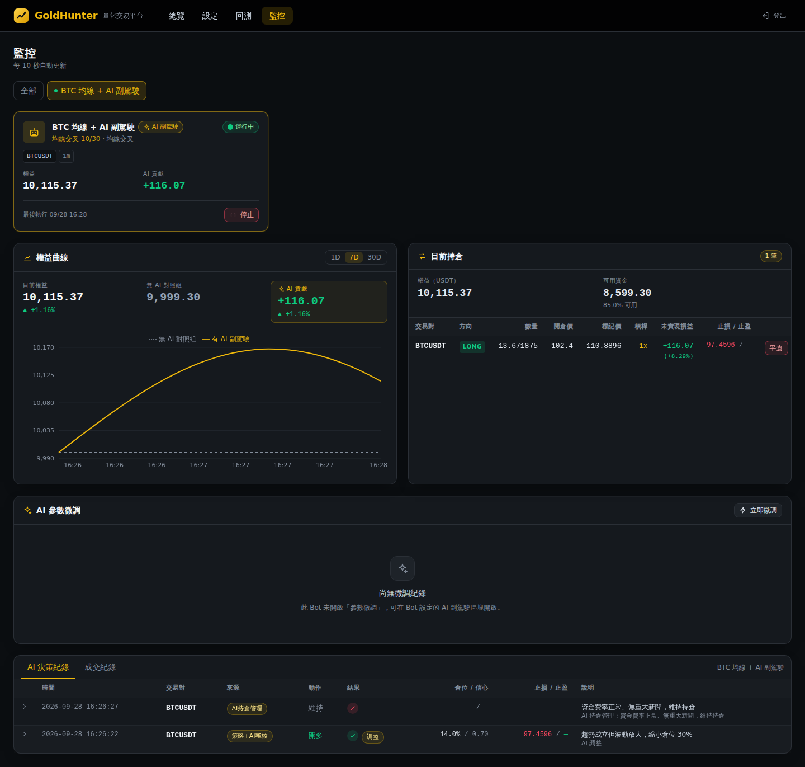
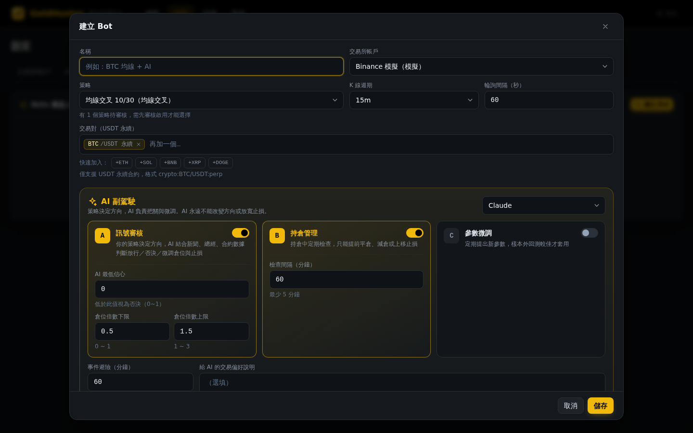
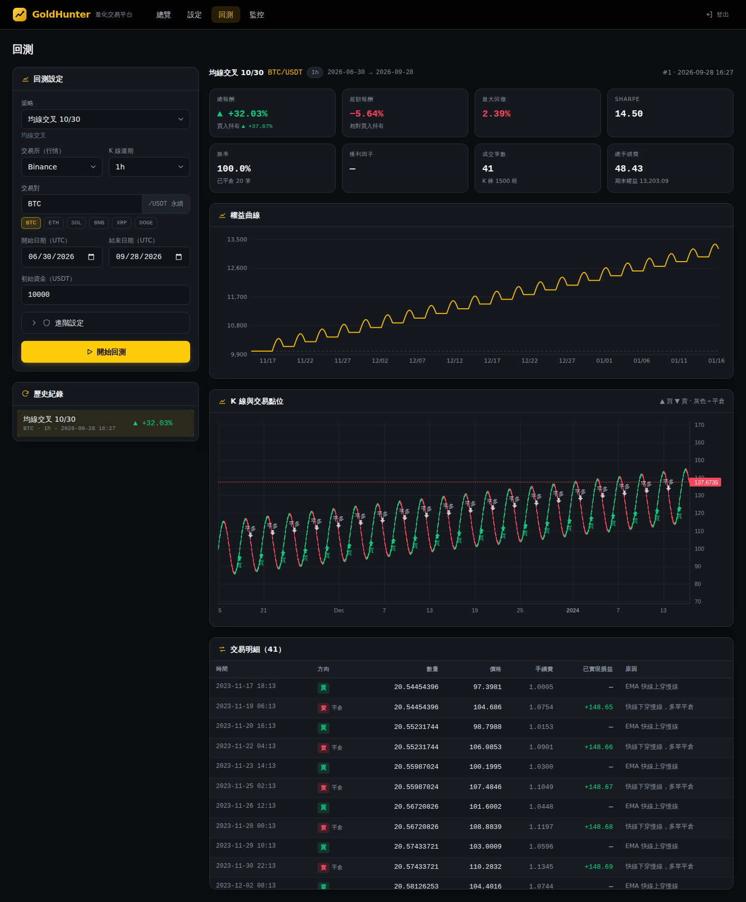
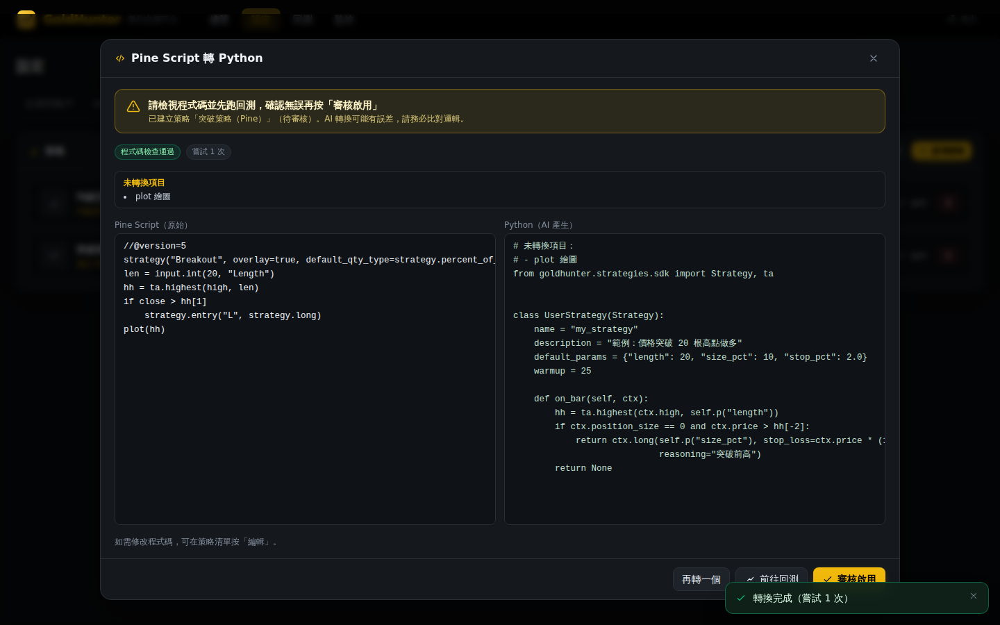
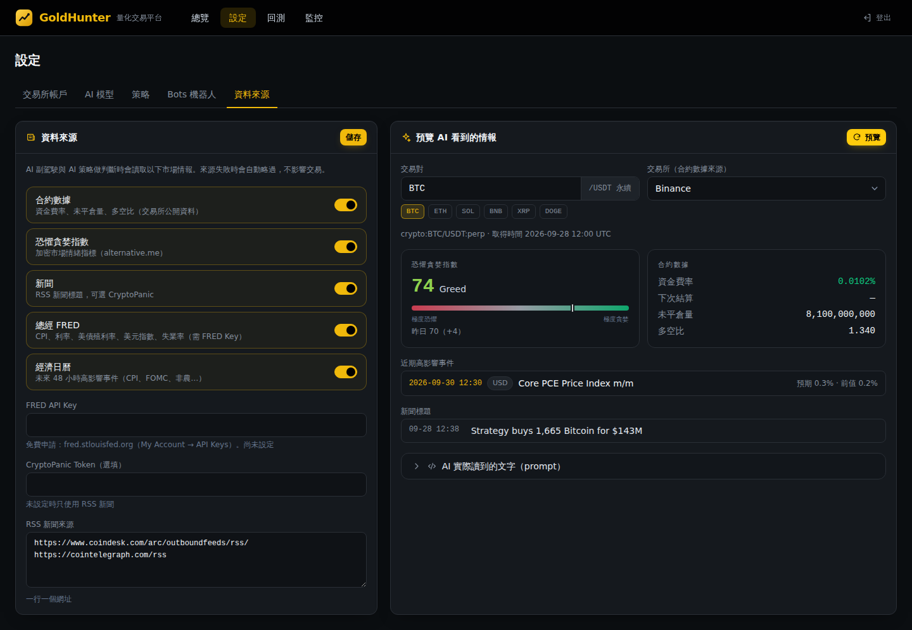
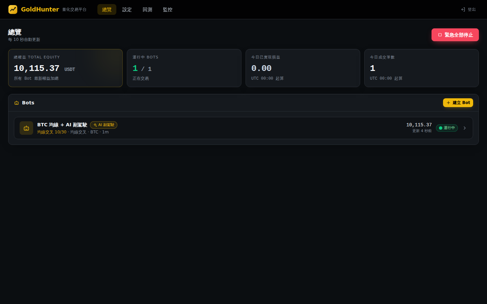

# GoldHunter 淘金者 · 智能量化交易策略平台

> AI × 量化策略 × 交易所 的自架交易平台。**讓 AI 當你的交易員，而且可以用投資大師的腦袋思考。**

GoldHunter 把「AI 模型的判斷分析能力」、「新聞 / 總經 / 合約數據」、「你寫好的策略（含 TradingView Pine Script）」與「交易所 API」串在一起，提供兩種模式：

| 模式 | 誰決定方向 | 適合 |
|---|---|---|
| **AI 交易員**（主要模式） | **AI 自己決定**做多做空、倉位與止損，不需要寫策略；可選擇讓 AI 參考你的策略訊號 | 想讓 AI 綜合技術面、消息面、籌碼面自主交易 |
| **我的策略 + AI 審核** | **你的策略**決定方向，AI 負責把關（放行 / 否決 / 調整）、持倉管理與參數微調 | 已有驗證過的策略，想用 AI 過濾假訊號 |

兩種模式都必須通過同一套風控，每一筆決策與 AI 理由都有紀錄。

**展示版**：<https://claude.ai/artifact/VTXpn43VSjaTuUAFmVpXwg>（模擬資料，可直接操作）

- 目前支援：**加密貨幣 USDT 永續合約**（Binance / OKX / Bybit / Hyperliquid）
- 規劃中：美股（Alpaca）、台股（永豐 Shioaji）——架構已預留，不需重寫

> ⚠️ **風險警語**：程式交易與槓桿合約具高度風險，可能損失全部本金。本專案僅供研究與學習，不構成投資建議。請務必先用「模擬交易」與「回測」充分驗證，實盤請從小資金開始。

| 監控：權益曲線、持倉、AI 決策紀錄 | Bot 設定（策略 + AI 審核） |
|---|---|
|  |  |
| **回測：K 線買賣點與績效** | **Pine Script 轉 Python** |
|  |  |
| **AI 看到的市場情報** | **總覽** |
|  |  |

---

## 目錄

- [功能總覽](#功能總覽)
- [安全設計（為什麼要重寫）](#安全設計為什麼要重寫)
- [快速開始](#快速開始)
- [使用教學](#使用教學)
  - [1. 設定交易所](#1-設定交易所)
  - [2. 設定 AI 模型](#2-設定-ai-模型)
  - [3. 設定資料來源（新聞 / 總經 / 合約數據）](#3-設定資料來源新聞--總經--合約數據)
  - [4. 建立策略](#4-建立策略)
  - [5. 貼上 TradingView 策略（自動轉換與審查）](#5-貼上-tradingview-策略pine-script--python自動審查)
  - [6. 回測與績效指標](#6-回測與績效指標)
  - [7. 投資大師與大師組合](#7-投資大師與大師組合)
  - [8. 建立 Bot（AI 交易員 / 策略 + AI 審核）](#8-建立-botai-交易員--策略--ai-審核)
  - [9. TradingView Webhook](#9-tradingview-webhook)
  - [10. 監控與紀錄](#10-監控與紀錄)
- [AI 交易員與 AI 審核詳解](#ai-交易員與-ai-審核詳解)
- [進場分析與智慧掛單](#進場分析與智慧掛單)
- [風控規則](#風控規則)
- [自訂 Python 策略 API](#自訂-python-策略-api)
- [系統架構](#系統架構)
- [設定參數](#設定參數)
- [開發與測試](#開發與測試)
- [常見問題](#常見問題)
- [路線圖](#路線圖)

---

## 功能總覽

| 頁面 | 功能 |
|---|---|
| **總覽** | 總權益、運行中 Bot、今日已實現損益、今日成交數；**緊急全部停止** |
| **設定** | 交易所帳戶、AI 模型、**投資大師**、策略（含 **Pine Script → Python**）、Bot 與風控、資料來源 |
| **回測** | 策略 × 交易對 × 週期 × 日期區間；報酬 vs 買入持有、最大回撤、Sharpe、勝率、獲利因子；權益曲線、**K 線圖買賣點**、交易明細；**現在進場的盈虧比分析** |
| **監控** | 哪些 Bot 在跑哪個策略、目前持倉（一鍵平倉）、**每筆成交紀錄**、**AI 決策紀錄**（含 AI 理由）、**有 AI vs 無 AI 對照組**權益曲線、AI 參數微調紀錄、**進場分析與等待中的掛單** |
| **大師組合** | 每位投資大師各自管理一個獨立的量化組合；權益曲線疊圖比較報酬、回撤、勝率 |

核心能力：

- **AI 交易員**：AI 每根 K 棒讀取行情、技術指標、新聞、總經、資金費率、恐懼貪婪指數與近期績效，自主決定開倉 / 平倉 / 觀望；一個 Bot 可同時交易多個幣種；可指定一個你的策略當「參考訊號」
- **投資大師組合**：上傳用女媧（nuwa-skill）蒸餾好的大師檔案（李佛摩、索羅斯、加密貨幣交易高手……），AI 依他擅長的方式設計組合（週期、選幣、持倉數、槓桿、能否做空），由他的思維**各自獨立管理一個組合**
- **進場分析**：訊號出現時算出現價進場的盈虧比、建議等待的進場點位、等得到的機率、勝率與期望值；可設定**自動掛單等待**更好的點位
- **標的範圍**：手動挑幣，或依規則自動挑選（成交量前 N 名、排除迷因幣、排除 / 只做指定幣種）
- **AI 審核**（搭配你的策略，三項可單獨開關）
  - **A. 訊號審核**：策略進場訊號 → AI 結合新聞、總經、資金費率、恐懼貪婪指數判斷 → 放行 / 否決 / 調整倉位與止損
  - **B. 持倉管理**：持倉中定期檢查，只能做「降低風險」的動作（提前平倉、減倉、上移止損）
  - **C. 參數微調**：AI 在你允許的範圍內提出新參數，**樣本外回測**較佳才套用
- **重大經濟事件避險**：CPI、FOMC、非農等高影響數據公布前後自動暫停開倉
- **對照組**（AI 審核模式）：同一策略「不經 AI」的訊號同步在模擬帳本執行，直接看出 AI 到底有沒有幫上忙
- **多家 AI**：Claude、OpenAI、DeepSeek、通義千問、本地 Ollama
- **策略來源**：內建策略、自訂 Python（可由 Pine Script 自動轉換）、TradingView 訊號
- **TradingView Webhook**：TradingView 警報直接觸發下單（同樣經過 AI 與風控）
- **模擬交易**：預設開啟，不需要 API Key 就能用真實行情跑

---

## 安全設計（為什麼要重寫）

本專案的架構參考了 [nofx](https://github.com/NoFxAiOS/nofx)，但**所有程式碼皆為重新撰寫，沒有複製任何 nofx 原始碼**。檢視 nofx 時發現兩個會把資料或費用送給原作者的設計（屬於公開功能而非隱藏後門，但使用者未必知情）：

1. `telemetry/experience.go`：每筆交易把交易所、幣種、金額、槓桿送到 Google Analytics
2. Hyperliquid 下單預設帶 **builder fee**（固定地址 `0x891d…af0d`），每筆交易額外付費給該地址

GoldHunter 的做法：

- ❌ **沒有任何遙測 / 追蹤 / 分析程式**
- ❌ **沒有 builder fee、推薦碼或任何第三方抽成**
- ✅ 對外連線**只有**：你設定的交易所、你設定的 AI 供應商、你開啟的資料來源（可在「設定 → 資料來源」逐一關閉）
- ✅ 交易所與 AI 的 API Key 以 **AES-256-GCM** 加密存放在本機 SQLite；介面上只顯示末 4 碼，無法讀回
- ✅ 所有 API 需要 Bearer Token；TradingView Webhook 使用每個 Bot 各自的密語並以常數時間比對
- ✅ 自訂 / AI 轉換的 Python 策略需通過 **AST 白名單檢查**（禁止 import 系統模組、檔案 / 網路存取、eval / exec、私有屬性存取），並需你**人工審核啟用**才能上線
- ✅ AI 的輸出一律經過程式硬性約束與風控，AI 無法自行改變交易方向或放寬止損
- ✅ 前端所有資源本地打包，沒有外部 CDN、字型或追蹤碼
- ✅ Docker 以非 root 使用者執行，預設只綁定 127.0.0.1

> 建議：交易所 API Key 請**關閉提領權限**，並設定 IP 白名單。

---

## 快速開始

### 方式一：Docker（推薦）

```bash
git clone https://github.com/virus11456/goldhunter.git
cd goldhunter
docker compose up -d --build
# 取得登入用的 API Token
cat data/api_token
```

打開 <http://localhost:8000>，貼上 API Token 登入。

### 方式二：本機開發

需求：Python 3.11+、Node.js 20+

```bash
# 後端
cd backend
python -m venv .venv && source .venv/bin/activate
pip install -e ".[dev]"
uvicorn goldhunter.main:app --reload --port 8000
# 首次啟動會在 backend/data/ 產生 api_token 與 secret.key

# 前端（另一個終端機）
cd web
npm install
npm run dev
# 打開 http://localhost:5173
```

> `data/secret.key` 是 API Key 的加密金鑰，**遺失就無法解密已存的金鑰**，請備份；也不要把 `data/` 上傳到任何地方。

---

## 使用教學

建議順序：**交易所（模擬）→ AI 模型 → 資料來源 → 策略 → 回測 → Bot（模擬）→ 觀察 → 實盤小資金**

### 1. 設定交易所

設定 → 交易所帳戶 → 新增

| 欄位 | 說明 |
|---|---|
| 模擬交易 | 預設開啟。使用該交易所的**真實公開行情** + 本機模擬成交，不需要 API Key |
| API Key / Secret | 實盤才需要。OKX 另需 Passphrase |
| Hyperliquid | API Key 填**錢包地址**，Secret 填 **API 錢包私鑰**（建議在 Hyperliquid 建立專用 API 錢包，不要用主錢包私鑰）|
| 測試網 | 使用交易所的 testnet |

按「測試連線」確認能讀到餘額。

### 2. 設定 AI 模型

設定 → AI 模型 → 新增

| 供應商 | 預設模型 | 備註 |
|---|---|---|
| Anthropic Claude | `claude-opus-5` | 使用官方 SDK 的結構化輸出（保證回傳合法 JSON），可設定 effort（low～max）|
| OpenAI | `gpt-5` | |
| DeepSeek | `deepseek-chat` | |
| 通義千問 | `qwen-max` | |
| Ollama（本地）| `llama3.1` | 不需 Key，Base URL 預設 `http://localhost:11434/v1` |

按「測試」確認連線。

### 3. 設定資料來源（新聞 / 總經 / 合約數據）

設定 → 資料來源。這些是 AI 交易員與 AI 審核判斷時會看到的市場情報：

| 來源 | 內容 | 費用 |
|---|---|---|
| 合約數據 | 資金費率、未平倉量、多空比（直接取自交易所公開 API）| 免費 |
| 恐懼貪婪指數 | alternative.me Fear & Greed Index | 免費 |
| 新聞 | CoinDesk、Cointelegraph RSS（可自訂）；可選填 [CryptoPanic](https://cryptopanic.com/developers/api/) token | 免費 |
| 總經數據 | FRED：CPI（含年增率）、聯邦基金利率、10 年期公債殖利率、美元指數、失業率 | 免費，需申請 [FRED API Key](https://fred.stlouisfed.org/docs/api/api_key.html) |
| 經濟日曆 | 本週美國高影響事件（CPI、FOMC、非農、PCE…）| 免費（社群常用的非官方 JSON 來源，失敗會自動略過）|

按「預覽 AI 看到的情報」可以看到實際送給 AI 的內容。任何來源失敗都不會中斷交易，只是 AI 少看一項資料。

### 4. 建立策略

設定 → 策略 → 新增，類型：

| 類型 | 說明 |
|---|---|
| `ma_cross` 均線交叉 | EMA 快慢線交叉進出場，ATR 止損，可反手做空 |
| `rsi_reversion` RSI 均值回歸 | RSI 超賣做多、回到中線平倉 |
| `mrspencer` MRSPENCER 黃金 | MRSPENCER v4.6B 量化版（由 Pine 原稿逐行轉換），見下方說明 |
| `ai` AI 決策 | 由 AI 根據行情 + 你寫的「策略指示」（中文即可）直接決策 |
| `python` 自訂 Python | 自己寫或由 Pine Script 轉換，見 [策略 API](#自訂-python-策略-api) |
| `tradingview` TradingView 訊號 | 不在本機運算，由 TradingView Webhook 觸發 |

#### MRSPENCER v4.6B 黃金策略

由 [TradingView 原稿](https://www.tradingview.com/script/ntJuSPyD-MRSPENCER-v4-6B/) 逐行轉換成平台內建策略（程式在 `backend/goldhunter/strategies/mrspencer.py`，參數名稱與 Pine 相同）。

- **邏輯**：1 分 K、台北 16:00–23:00；價格撞到 240 分鐘區間的頂 / 底（30 分鐘位移 ≥ $15、在極值滯留 ≥ 20 分鐘）時逆勢鋪單 → 逆行 $2 爬梯加碼、每 $5 幾何攤平（×1.3，最多 3 段）、被套 ≥ $8 時配對救援 → 合併均價獲利 $2.3（攤平後 $4.5）整組出場；整籃逆行 $25 停損並冷卻 240 根
- **標的**：本平台只做 USDT 永續，請用黃金代幣永續合約（**PAXG** 或 **XAUT**，1 顆 ≈ 1 盎司），所有「$」門檻都是價差可直接沿用；各交易所有沒有上架請先確認，行情與 Vantage XAUUSD 不完全相同，**上線前請用該交易所的資料重新回測、調整 rescueStep / rescueGeo / stopUsd**
- **口數換算**：Pine 1 口 = 1 盎司；`unit` 設定 1 口是幾顆幣，`scale_with_equity` 開啟時依「開籃時權益 ÷ 1,500」等比例放大
- **風控**：建立 Bot / 回測時自動套用建議風控（允許加碼、槓桿 25、總曝險 2,500%、不設當日熔斷），你改過的值優先。滿 9 口約是權益的 22 倍名目價值，原作者回測最大回撤 40%，**這是高風險策略**
- **上線流程**：建立後先進模擬期（7 天、3 筆），之後才能用在實盤
- **與 Pine 的差異**：引擎每根 K 棒送一個決策，同一根同時觸發的加碼 / 攤平 / 配對會合併成一筆；同時觸發出場與加碼時只出場；另附「整籃停損 + $10」的災難止損由引擎盤中監控（只在 Bot 漏掉 K 棒時用到）

### 5. 貼上 TradingView 策略（Pine Script → Python，自動審查）

設定 → 策略 → **貼上 Pine Script**

1. 貼上 Pine Script（`strategy()` 或 `indicator()` 皆可），選擇 AI 模型，按「轉換並審查」
2. AI 轉成 Python 策略（安全檢查沒過會自動把錯誤回饋給 AI 重寫，最多 3 次）
3. **自動審查四關**（約 1～2 分鐘）：

| 關卡 | 做什麼 |
|---|---|
| ① 安全檢查 | 禁止檔案 / 網路 / 系統存取、eval / exec 等危險寫法 |
| ② 試跑 | 用最近 90 天歷史 K 線實際回測：不能出錯、要有進場、進場次數不能異常頻繁 |
| ③ AI 交叉檢查 | 另一次 AI 呼叫逐條比對 Pine 與 Python 的進出場條件、止損、參數預設值；有「嚴重」差異就不通過 |
| ④ TradingView 對帳（選用） | 上傳 TradingView「策略測試器 → 交易清單 → 匯出」的 CSV，逐筆比對進場時間與方向，吻合率 ≥ 90% 才通過；會自動判斷 CSV 的時區 |

4. **通過** → 進入 **模擬期**：只能用在模擬帳戶；滿 7 天且模擬帳戶平倉滿 3 筆後自動開放實盤（也可在策略頁手動「開放實盤」）
5. **未通過** → 維持「待審核」，報告會寫清楚哪一關、什麼問題；按「讓 AI 修正並重審」會把問題回饋給 AI 修正後再審一次

進階選項：審查用的交易對 / K 線週期 / 交易所（預設 BTC、1h、Binance）。
對應規則：`x[1]` → `series[-2]`、`strategy.entry(long)` → `ctx.long(...)`、`strategy.close` → `ctx.close_position()`、`strategy.exit(stop/limit)` → `stop_loss / take_profit`、`input.*()` → `default_params`。

> 修改過程式碼的策略會自動回到「待審核」。無法轉換的功能（例如 `request.security` 多週期、繪圖）會列在「未轉換項目」。

### 6. 回測與績效指標

回測頁：選策略、交易所、交易對、週期、日期區間、初始資金（進階設定可調手續費、滑價、參數與風控）。

每次回測都會顯示以下指標；策略頁的每個策略也會顯示「最近一次回測」的重點指標：

| 類別 | 指標 |
|---|---|
| 報酬 | 總報酬、年化報酬（CAGR）、買入持有報酬、超額報酬 |
| 風險 | 最大回撤、最長回撤期間（天）、年化波動率 |
| 風險調整後報酬 | Sharpe、Sortino、Calmar |
| 交易品質 | 交易筆數、勝率、盈虧比（平均賺 ÷ 平均賠）、獲利因子、每筆期望值、最大單筆獲利 / 虧損、最多連續虧損 |
| 效率與成本 | 平均持倉時間、持倉時間佔比（曝險）、總手續費 |

- **無未來函數**：第 i 根收盤計算訊號，第 i+1 根**開盤價**成交；止損 / 止盈用 K 棒高低價判斷，跳空以開盤價成交
- 回測與實盤共用同一套策略、風控與撮合邏輯
- 歷史資料透過交易所公開 API 下載（單次最多 200,000 根，1 分 K 約 139 天）
- AI 交易員也能回測，但會產生 API 費用（有 `max_ai_calls` 上限）；**新聞 / 總經類 AI 判斷無法準確回測**（歷史新聞難以重建，且模型可能已知道後來的行情），請用模擬帳戶驗證

### 7. 投資大師與大師組合

每位投資大師的風格差很多（李佛摩做突破、索羅斯看總經與反身性、有人只做多不用槓桿），所以不把他們湊成委員會，而是**每位大師用他擅長的方式，各自管理一個獨立的量化組合**，最後在「大師組合」頁比較誰的表現好。

**第一步：用女媧蒸餾大師（在你自己的 Claude 裡做，不花本系統的 API 費）**

1. 在 Claude Code 或 Claude App 安裝 [nuwa-skill](https://github.com/alchaincyf/nuwa-skill)（MIT）：輸入「幫我安裝這個 skill：https://github.com/alchaincyf/nuwa-skill」
2. 輸入「蒸餾一個〈人名〉，聚焦他的交易與風險管理思維」。加密貨幣交易高手也可以，資料越多越準
3. 女媧會產生 `〈人名〉-perspective/` 資料夾，裡面有 `SKILL.md`（思維檔案）與 `FIDELITY.md`（保真度評分卡）

**第二步：上傳（設定 → 投資大師）**

- 把整個資料夾壓成 **zip** 上傳，或單獨上傳 `SKILL.md`（可另外附 `FIDELITY.md`）
- 系統自動讀取女媧的格式：
  - **保留**交易判斷用得到的段落：身份卡、核心心智模型、決策啟發式、價值觀與反模式、誠實邊界、內在張力、表達 DNA
  - **捨棄**對話用的段落：角色扮演規則、回答工作流（會叫 AI 上網搜尋）、示例對話、調研來源——不影響判斷，每次 AI 決策還能少送幾千個 token
  - 讀取 `FIDELITY.md` 的總分、等級與各維度分數
- **安全**：zip 裡只讀 `.md` / `.txt`，程式與圖片一律忽略；內容只當作文字給 AI 參考，**不會執行任何程式**

**上傳健檢**（不呼叫 AI、不花錢）：檢查有沒有核心心智模型、決策規則、反模式、誠實邊界、保真度評分卡，以及「交易相關度」（交易 / 止損 / 倉位 / 風險等詞出現次數）。只談人生或商業思維的檔案會被標成「檔案不足」，建議在女媧蒸餾時加上「聚焦他的交易與風險管理思維」重新蒸餾。**大師組合的表現取決於這份檔案的品質。**

**上線流程**

| 狀態 | 條件 | 可以做什麼 |
|---|---|---|
| 保真度未達標 | 沒有評分卡或總分 < 70 | 只能用在模擬帳戶 |
| 模擬期 | 總分 ≥ 70 | 模擬帳戶跑滿 7 天且平倉 3 筆後自動開放實盤（也可手動提早開放） |
| 已啟用 | 走完模擬期 | 可用在實盤帳戶 |

**第三步：建立大師組合（大師組合頁 → 新增大師組合）**

1. 選一位大師與 AI 模型 → AI 讀他的思維檔案，設計**他的組合計畫**：
   - K 線週期與持倉時間（例如李佛摩：4 小時線、持有數天到數週）
   - 選幣方式：成交量前 N 名自動挑選（可排除迷因幣、只在指定幣種中挑）或固定幾個幣
   - 最多同時持有幾個標的、單一標的倉位、最大槓桿（1～10）、能不能做空
   - 進場方式（市價 / 依進場分析掛單等待）、給 AI 交易員的交易偏好
   - 如果這位大師不適合加密貨幣合約（例如只做長期價值投資、反對槓桿），會標示「不太適合」並給最保守的版本，由你決定要不要用
2. 你可以修改計畫的任何一項
3. 選交易所帳戶與這個組合的**模擬資金**（每個組合各自獨立計算）→ 建立並啟動

每個組合就是一個「AI 交易員」Bot，大腦是那位大師，所以在監控頁也看得到它的持倉、成交與每次決策的理由。

**大師組合頁**：各組合的權益曲線疊在同一張圖，並列出報酬、最大回撤、勝率、交易筆數、目前持倉數。跑不到 14 天或平倉不到 30 筆的組合會標示「樣本太少，績效還不具參考性」。

> 大師檔案是依公開資料推論的思維框架，不代表本人觀點，也不保證獲利。為了省錢，長的大師檔案會使用 Claude 的提示快取，重複送出時只收約一折的讀取費。

### 8. 建立 Bot（AI 交易員 / 策略 + AI 審核）

設定 → Bots → 建立 Bot，先選模式：

**AI 交易員**（預設，不需要先建立策略）
- 名稱、交易所帳戶、AI 模型、交易對（可放多個，例如 BTC、ETH、SOL，AI 會逐一判斷）、K 線週期
- **交易偏好**：用中文寫，例如「順勢交易、不逆勢抄底；重大數據前不開倉；最多 3 倍槓桿」
- **參考策略**（選填）：選一個你的策略，AI 會看到它的訊號當參考，但不會盲從
- **交易大腦**（選填）：選一位投資大師，AI 用他的框架決策（想讓大師完整依自己的風格配置，建議直接用「大師組合」）
- **最低信心**：AI 信心低於此值時改為觀望
- **重大經濟事件避險**：CPI、FOMC 等公布前後幾分鐘不開新倉

**我的策略 + AI 審核**
- 交易所帳戶、策略、交易對、K 線週期、輪詢秒數
- **AI 審核**：勾選 A 訊號審核 / B 持倉管理 / C 參數微調、事件避險分鐘數、給 AI 的交易偏好說明

**標的範圍**（兩種模式都有）：手動選幣，或「依規則自動挑選」——交易所 24 小時成交額前 N 名的 USDT 永續，可排除迷因幣、排除指定幣種、或只在指定幣種中挑選；每 6 小時更新一次，持倉中的幣會繼續管理到平倉。

**進場方式**（兩種模式都有）：「市價」＝訊號出現立刻進場；「分析後掛單等待」＝依[進場分析](#進場分析與智慧掛單)在建議點位掛單，最多等 N 根 K 棒，期望值為負時可選擇直接放棄。

兩種模式都可在 **進階設定 → 風控** 調整上限，見 [風控規則](#風控規則)。

建立後到「監控」頁按「啟動」。

### 9. TradingView Webhook

每個 Bot 都有自己的 Webhook URL 與密語（在 Bot 設定中可複製、可重新產生）。

1. TradingView → 建立警報 → 通知 → 勾選 Webhook URL，填入：
   `https://你的網域/api/tradingview/webhook/{bot_id}`
2. 訊息（Message）填入：

```json
{
  "passphrase": "你的 Bot 密語",
  "action": "{{strategy.order.action}}",
  "market_position": "{{strategy.market_position}}",
  "size_pct": 10
}
```

| 欄位 | 說明 |
|---|---|
| `action` | `buy` / `sell` / `long` / `short` / `close` / `exit` / `flat` |
| `market_position` | `long` / `short` / `flat`（strategy 腳本建議帶，以它為準）|
| `size_pct` | 選填，佔權益 %（仍受風控上限限制）|
| `leverage` / `stop_loss` / `take_profit` | 選填 |
| `symbol` | 選填，Bot 有多個交易對時指定（如 `ETHUSDT`）|

注意：

- 只接受**已啟動**的 Bot；訊號一樣會經過**事件避險、AI 審核（若開啟）與風控**
- TradingView 只能打 80/443 埠，請用 HTTPS 反向代理（Caddy / Nginx / Cloudflare Tunnel）對外，不要直接暴露 8000 埠

### 10. 監控與紀錄

- **Bot 卡片**：策略、交易對、狀態（運行中 / 已停止 / 錯誤 / 熔斷）、最後執行時間、錯誤訊息
- **持倉**：方向、數量、均價、標記價、未實現損益、引擎管理的止損止盈、一鍵平倉
- **權益曲線**：AI 審核模式同時畫出「有 AI」與「無 AI 對照組」
- **成交紀錄**：每一筆成交的時間、交易對、方向、數量、價格、手續費、已實現損益、訊號來源
- **AI 決策紀錄**：每次決策的來源、動作、是否通過、理由、AI 信心、原始訊號 vs 調整後、AI 原始回覆、token 用量
- **AI 參數微調**：歷次建議、新舊參數樣本外回測對照、一鍵套用
- **進場分析**：每個標的目前的訊號、現價盈虧比、建議等待點位、等待中的掛單（剩幾根 K 棒到期）

---

## AI 交易員與 AI 審核詳解

### AI 交易員

每根 K 棒收盤時（每個交易對各一次），AI 會拿到：

- 最近 40 根 K 線、EMA20/50、RSI、ATR、MACD
- 市場情報：資金費率、未平倉量、多空比、恐懼貪婪指數、新聞標題、總經數據、未來 48 小時高影響事件
- 目前持倉、帳戶權益、此 Bot 近期已平倉績效
- 你寫的交易偏好，以及（若有設定）參考策略目前的訊號
- 風控上限（單筆倉位、槓桿、能否放空）

AI 回傳結構化決策：`open_long` / `open_short` / `close` / `hold`、倉位 %、槓桿、止損、止盈、信心與理由（繁體中文）。
信心低於門檻會改為觀望；開倉仍須通過事件避險與風控（止損必填、倉位與槓桿上限、單日虧損熔斷……）。

### AI 審核（搭配你的策略）

```
  你的策略（規則 / Pine 轉換 / TradingView）
            │ 進場訊號（方向由你決定）
            ▼
  ┌─────────────────────┐
  │ 經濟事件避險（規則） │── CPI/FOMC 前後 → 不開倉
  └─────────────────────┘
            ▼
  ┌─────────────────────────────────────────────┐
  │ A. AI 訊號審核                               │
  │  輸入：K 線、指標、合約數據、恐懼貪婪、       │
  │        新聞標題、總經數據、事件日曆、         │
  │        策略近 10 筆績效、你的偏好說明         │
  │  輸出：放行 / 否決 / 調整（倉位倍數、止損止盈）│
  └─────────────────────────────────────────────┘
            ▼  程式硬性約束（不能反向、倍數上限、止損只能收緊）
  ┌──────────┐      ┌────────┐
  │   風控    │ ───▶ │  下單   │
  └──────────┘      └────────┘
            │ 持倉中
            ▼
  B. AI 持倉管理（每 N 分鐘）：維持 / 平倉 / 減倉 / 上移止損（只能降低風險）
  C. AI 參數微調（每 N 小時）：樣本內給 AI 看 → 提案 → 樣本外回測勝出才採用
```

**AI 能做與不能做的事**

| | 可以 | 不可以 |
|---|---|---|
| A 訊號審核 | 放行、否決、倉位 ×0.5～×1.5（可調）、收緊止損、設定止盈 | 改變方向、放寬止損、超過風控上限 |
| B 持倉管理 | 全部平倉、部分減倉、止損往有利方向移動 | 加倉、開新倉、止損往不利方向移動 |
| C 參數微調 | 在你勾選的參數與範圍內調整 | 動未勾選的參數、在樣本外表現較差時套用 |

AI 回傳格式錯誤、連線失敗或信心不足時，一律**保守處理**（不開倉 / 維持現狀）。

**費用估算**：AI 只在「新 K 棒出現進場訊號」時審核一次、持倉中每 N 分鐘檢查一次（預設 60 分鐘），不會每分鐘呼叫。以 15 分鐘 K 線、每天數個訊號計算，每天約數十次呼叫。

**對照組**：開啟 A 或 B 時，系統會用同樣的初始資金建立「不經 AI」的模擬帳本，完全依照策略原始訊號執行。監控頁的「AI 貢獻」= 實際權益 − 對照組權益。

---

## 進場分析與智慧掛單

策略或 AI 給出進場訊號時，不一定要馬上市價追進去。系統會算：

| 項目 | 說明 |
|---|---|
| 止損 / 目標 | 用策略或 AI 給的；沒有的話用 2 倍 ATR 止損、近 50 根前高 / 前低（太近時用 3 倍 ATR）當目標 |
| **現價盈虧比** | （目標 − 現價）÷（現價 − 止損） |
| **建議等待點位** | 回檔到 EMA20、回測突破點、回檔 0.5 ATR 等候選點位（必須比現價好、且不越過止損），各自的盈虧比 |
| **等得到的機率** | 用過去的 K 棒（有策略時用它過去的訊號點）模擬：掛在這個點位、N 根 K 棒內成交的比例 |
| **勝率與期望值** | 成交後先碰到目標還是止損；期望值＝勝率 × 報酬 −（1 − 勝率）× 風險，已考慮等不到的情況 |
| **建議** | 市價進場、掛單等待某個點位，或期望值為負時建議放棄 |

- **高頻週期**（1、3、5 分鐘）差異很小，一律建議市價
- **自動掛單等待**：Bot 進場方式選「分析後掛單等待」時，引擎會在建議點位等待（價格碰到才以該價成交），超過等待根數就取消；等待期間出現平倉 / 反向訊號也會取消
- 目前沒有訊號時，依趨勢假設方向（價格在 EMA50 之上假設做多、之下假設做空），畫面會標示「假設」與原因；也可以手動切換做多 / 做空
- 分析結果顯示在：**監控頁**（每個標的）、**回測頁**（現在進場分析，沒有訊號時可假設做多 / 做空）、**AI 決策紀錄**（每次開倉判斷附上的盈虧比與建議）

---

## 風控規則

所有訊號（策略、AI、TradingView、手動）下單前都必須通過風控。**平倉永遠放行**，開倉才檢查。

| 參數 | 預設 | 說明 |
|---|---|---|
| `max_position_pct` | 20 | 單筆倉位上限（佔權益 %，未含槓桿）|
| `max_total_exposure_pct` | 100 | 總曝險上限（名目價值佔權益 %，含槓桿）|
| `max_leverage` | 3 | 最大槓桿（也受交易所上限限制）|
| `daily_loss_limit_pct` | 5 | 單日虧損達此 % 即熔斷，當日（UTC）停止開倉 |
| `require_stop_loss` | true | 開倉必須有止損 |
| `default_stop_loss_pct` | 3 | 訊號沒帶止損時自動補上；設為空則直接拒絕 |
| `min_confidence` | 0 | 決策信心低於此值拒絕 |
| `max_orders_per_hour` | 20 | 每小時下單次數上限（防止策略失控）|
| `allow_pyramiding` | false | 是否允許同方向加碼 |
| `max_positions` | 0 | 最多同時持有幾個標的（0＝不限；大師組合會依風格設定）|
| `long_only` | false | 只做多 |
| `exchange_stop` | true | 實盤帳戶在交易所掛只減倉的條件止損單 |

止損 / 止盈由引擎監控（每次輪詢比對最新價，觸發即市價平倉），所有交易所行為一致。

**交易所端止損單**（`exchange_stop`，預設開啟）：實盤帳戶開倉後，系統同時在交易所掛一張「只減倉」的條件止損單，數量＝目前持倉、價格＝目前止損價；加碼、減倉或止損價移動時自動撤掉舊單重掛，平倉後自動撤銷。**Bot 停止、主機當機或斷網時持倉仍受保護。**

- 止損狀態存進資料庫，重啟後接續盯盤，也知道交易所上掛著哪張單，不會重複掛
- 交易所止損單觸發後，下一輪會在決策紀錄記下「交易所止損單已觸發」（成交價請到交易所查看）
- 掛單失敗（例如交易所不支援、權限不足）會記錄原因並改由平台盯盤；監控頁的持倉會顯示「✓ 交易所已掛止損單」或「平台盯盤」
- 止盈仍由平台盯盤（Bot 停止時不會止盈）
- 模擬帳戶沒有交易所，一律由平台盯盤

「緊急全部停止」只停止 Bot，**不會自動平倉**。

---

## 自訂 Python 策略 API

```python
from goldhunter.strategies.sdk import Strategy, ta


class UserStrategy(Strategy):          # 類別名稱必須是 UserStrategy
    name = "breakout"
    description = "突破 20 根高點做多"
    default_params = {"length": 20, "size_pct": 10, "stop_pct": 2.0}
    warmup = 25                         # 至少需要幾根 K 棒

    def on_bar(self, ctx):              # 每根 K 棒收盤呼叫一次，可寫成 async def
        hh = ta.highest(ctx.high, self.p("length"))
        if ctx.position_size == 0 and ctx.price > hh[-2]:
            return ctx.long(self.p("size_pct"),
                            stop_loss=ctx.price * (1 - self.p("stop_pct") / 100),
                            reasoning="突破前高")
        return None                     # None = 不動作
```

**ctx（StrategyContext）**

| 屬性 / 方法 | 說明 |
|---|---|
| `ctx.open / high / low / close / volume` | `list[float]`，最後一個元素是最新收盤的 K 棒 |
| `ctx.price` | 最新收盤價 |
| `ctx.position_size` | `>0` 多單、`<0` 空單、`0` 空手 |
| `ctx.position` | 持倉物件（均價、槓桿、未實現損益）或 `None` |
| `ctx.balance` | 權益與可用資金 |
| `ctx.capabilities.supports_short` | 是否可放空 |
| `ctx.long(size_pct, stop_loss=None, take_profit=None, leverage=1, reasoning="")` | 做多 |
| `ctx.short(...)` | 做空 |
| `ctx.close_position(reasoning="")` | 平倉 |
| `self.p("參數名")` | 讀取參數 |

**ta 指標**（命名對應 Pine 的 `ta.*`；回傳與輸入等長的 list，資料不足處為 `None`）

`sma` `ema` `rma` `rsi` `atr` `tr` `stdev` `bb`（中、上、下軌）`macd`（線、訊號、柱）`highest` `lowest` `change` `crossover` `crossunder`

**安全限制**：只能 import `math`、`statistics`、`goldhunter.strategies.sdk`；禁止檔案 / 網路 / 系統存取、`eval` / `exec` / `getattr` 等、存取 `_` 開頭屬性。這是防呆與防誤用，**不是作業系統等級的沙箱** —— 請只執行你看得懂的程式碼。

---

## 系統架構

```
goldhunter/
├── backend/                     Python 3.11 · FastAPI · SQLModel(SQLite)
│   └── goldhunter/
│       ├── core/                Instrument、Order、Decision 等跨市場模型；金鑰加密
│       ├── exchanges/           ExchangeAdapter 介面、ccxt（4 家交易所）、模擬交易所
│       ├── ai/                  AIProvider 介面、Claude、OpenAI 相容
│       ├── strategies/          策略介面、ta 指標、內建 / AI / 自訂策略、安全檢查
│       ├── intel/               市場情報：合約數據、情緒、新聞、總經、經濟日曆
│       ├── copilot/             AI 審核：訊號審核、持倉管理、參數微調
│       ├── personas/            投資大師：讀取女媧蒸餾檔案、保真度評分卡、大師組合計畫、上線流程
│       ├── analysis/            進場分析：盈虧比、等待點位、成交機率、期望值
│       ├── risk/                風控
│       ├── engine/              Bot 執行引擎、Bot 管理
│       ├── backtest/            回測引擎、歷史資料
│       ├── tradingview/         Pine 轉換、Webhook
│       ├── store/               資料庫模型
│       └── api/                 REST API
└── web/                         React 18 · TypeScript · Vite · Tailwind
```

**統一商品代碼** `market:symbol:type`：`crypto:BTC/USDT:perp`（之後：`us:AAPL:stock`、`tw:2330:stock`）。每個交易所以 `Capabilities` 宣告能否放空、槓桿上限、最小單位、交易時段，策略與風控因此能跨市場共用。

**接新市場**只需實作 `ExchangeAdapter`（`fetch_candles`、`fetch_balance`、`fetch_positions`、`place_order` 等）並在 `exchanges/registry.py` 註冊。

API 文件：啟動後打開 <http://localhost:8000/docs>。

---

## 設定參數

環境變數（或 `.env`，參考 `.env.example`），全部選填：

| 變數 | 預設 | 說明 |
|---|---|---|
| `GOLDHUNTER_DATA_DIR` | `./data` | 資料庫、金鑰、token 存放位置 |
| `GOLDHUNTER_API_TOKEN` | 自動產生 | 登入介面 / 呼叫 API 用的 token |
| `GOLDHUNTER_SECRET_KEY` | 自動產生 | 加密 API Key 用的 AES-256 金鑰（base64 32 bytes）|
| `GOLDHUNTER_RESUME_BOTS` | `true` | 服務重啟後自動恢復原本在跑的 Bot |
| `GOLDHUNTER_CORS_ORIGINS` | `["http://localhost:5173"]` | 前端開發伺服器位址 |

---

## 開發與測試

```bash
cd backend
source .venv/bin/activate
pytest            # 單元測試 + 端對端測試（不需網路、不需 API Key）
ruff check .      # 程式碼檢查

cd ../web
npm run build     # TypeScript 型別檢查 + 打包
```

測試涵蓋：技術指標、模擬撮合、風控、策略安全檢查、Pine 轉換重試、回測無未來函數、AI 審核約束、參數微調、Claude API 請求格式、交易所下單參數，以及透過 REST API 的完整流程（AI 交易員多幣種、AI 否決 / 調整 / 持倉管理 / 事件避險 / TradingView / 對照組）。

---

## 常見問題

**Q：模擬交易重啟後持倉會不見嗎？**
會。模擬帳戶的狀態存在記憶體，重啟後從初始資金重新開始（成交與決策紀錄會保留在資料庫）。

**Q：止損單會掛在交易所上嗎？**
目前由引擎監控並在觸發時市價平倉，不掛交易所條件單。好處是四家交易所行為一致；缺點是 Bot 停止或主機斷線時沒有保護。建議實盤時另外在交易所設定一個較寬的保險止損。

**Q：AI 會不會亂下單？**
AI 的每個輸出都經過程式硬性約束與風控，無法改變你策略的方向、無法放寬止損、無法超過倉位與槓桿上限。回傳異常時一律不開倉。

**Q：可以只用 AI、不寫策略嗎？**
可以，建立 Bot 時選「AI 交易員」，用中文寫交易偏好即可。AI 交易員的判斷無法準確回測，建議先用模擬帳戶跑一段時間；如果你有驗證過的策略，也可以設為「參考策略」，或改用「我的策略 + AI 審核」模式。

**Q：Hyperliquid 為什麼顯示 USDT？**
系統統一以 `BTC/USDT` 表示，送到 Hyperliquid 時自動轉為 `BTC/USDC:USDC`。

---

## 路線圖

- [x] 加密貨幣永續：Binance / OKX / Bybit / Hyperliquid
- [x] 多家 AI、Pine Script 轉換、TradingView Webhook
- [x] AI 交易員（多幣種、參考策略）、AI 審核（訊號審核 / 持倉管理 / 參數微調）、新聞 / 總經 / 合約數據
- [x] 回測、模擬交易、對照組
- [x] 投資大師（上傳女媧蒸餾檔案）、大師組合、標的範圍規則
- [x] 進場分析與自動掛單等待
- [ ] Telegram 通知
- [ ] 交易所端條件止損單
- [ ] 美股（Alpaca）
- [ ] 台股（永豐 Shioaji：整股 / 零股、漲跌停、T+2）
- [ ] 多模型投票

